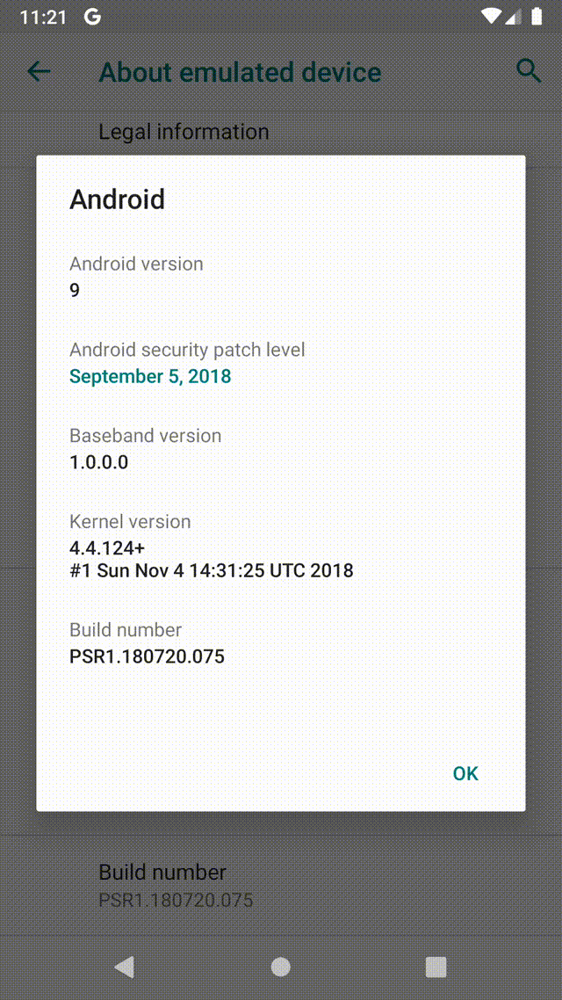

android-screen-record
===

- A command to take screen record for Android
- The movie file convert into gif animation automatically.

# Sample

## Original mp4 file

[Original mp4 file](./sample/original.mp4)

## GIF

FPS 10/20/30

  

# Usage

Execute following command to begin screen recording

```
$ android-screen-record
```

Interrupt(Ctrl + C) when you want to finish recording.
The mp4 file and gif files are copied to `$HOME/Desktop/android-screen-record` directory.

# Requirements

This command is available for only macOS. and also needs following commands.

- `adb`
  - Installed by android-platform-tools
- `ffmpeg`
- `peco`

# Install

```
$ brew tap tomorrowkey/self
$ brew install tomorrowkey/self/android-screen-record
```

# License

```
Copyright 2019 tomorrowkey

Licensed under the Apache License, Version 2.0 (the "License");
you may not use this file except in compliance with the License.
You may obtain a copy of the License at

   http://www.apache.org/licenses/LICENSE-2.0

Unless required by applicable law or agreed to in writing, software
distributed under the License is distributed on an "AS IS" BASIS,
WITHOUT WARRANTIES OR CONDITIONS OF ANY KIND, either express or implied.
See the License for the specific language governing permissions and
limitations under the License.
```
